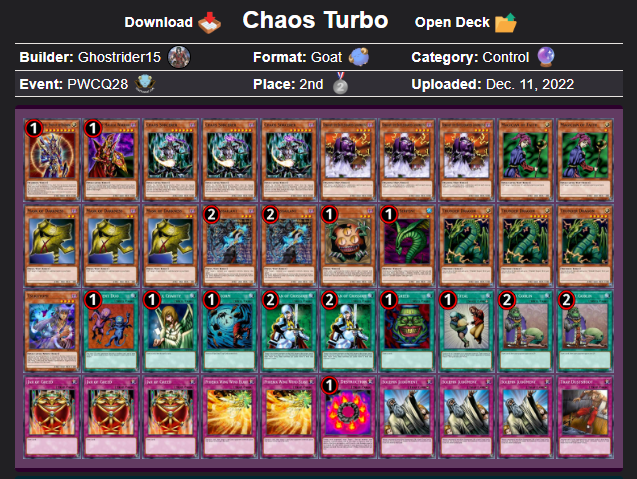

# Deck Model Demonstration

A deep dive into the model's performance on full decks.

## Table of Contents

1. [Setup](#setup)
    - [Imports](#imports)
    - [Query data](#query-data)
2. [Data Transformations](#data-transformations)
    - [Expand card_name by card_amount](#expand-card_name-by-card_amount)
    - [Filter out deck classes below 5 occurrences](#filter-out-deck-classes-below-5-occurrences)
3. [Deck Model Preparation](#deck-model-preparation)
    - [Load model, encoder, and vectorizer](#load-model-encoder-and-vectorizer)
    - [Create predict_with_confidence function](#create-predict_with_confidence-function)
4. [Deck Prediction](#deck-prediction)
    - [Predict all deck classes in set](#predict-all-deck-classes-in-set)
    - [Filter where the model failed](#filter-where-the-model-failed)
5. [Model Demonstrations](#model-demonstrations)
    - [Example 1](#example-1)
    - [Example 2](#example-2)
    - [Example 3](#example-3)
    - [Example 4](#example-4)
    - [Example 5](#example-5)
    - [Example 6](#example-6)
    - [Example 7](#example-7)
    - [Example 8](#example-8)
    - [Example 9](#example-9)
6. [Conclusion](#conclusion)


## Setup

### Imports


```python
import joblib
import polars as pl
from plotnine import *

from gfwldata.utils.db import sync_engine
```

### Query data


```python
query = """
select
    replace(url, '/api', '') as deck_url,
    deck_class as actual_deck,
    card_name,
    card_amount
from event_decks
where published_at > '2006-01-01'
    and deck_type == 'main'
"""

cards_tbl = pl.read_database(
    query=query,
    connection=sync_engine
)

with pl.Config(fmt_str_lengths=100):
    print(cards_tbl.head(2))
```

    shape: (2, 4)
    ┌───────────────────────────────────┬─────────────┬──────────────────────────────────┬─────────────┐
    │ deck_url                          ┆ actual_deck ┆ card_name                        ┆ card_amount │
    │ ---                               ┆ ---         ┆ ---                              ┆ ---         │
    │ str                               ┆ str         ┆ str                              ┆ i64         │
    ╞═══════════════════════════════════╪═════════════╪══════════════════════════════════╪═════════════╡
    │ https://formatlibrary.com/decks/5 ┆ Warrior     ┆ Black Luster Soldier - Envoy of  ┆ 1           │
    │ 2186                              ┆             ┆ the Beginning                    ┆             │
    │ https://formatlibrary.com/decks/5 ┆ Warrior     ┆ Blade Knight                     ┆ 3           │
    │ 2186                              ┆             ┆                                  ┆             │
    └───────────────────────────────────┴─────────────┴──────────────────────────────────┴─────────────┘
    

## Data Transformations

### Expand card_name by card_amount


```python
prepared_cards_tbl = (
    cards_tbl
    .select(
        pl.exclude("card_amount").repeat_by("card_amount").explode()
    )
    .group_by("deck_url")
    .agg(
        actual_deck=pl.col("actual_deck").first(),
        cards=pl.col("card_name").map_elements(lambda s: "|".join(s), return_dtype=pl.String)
    )
    .sort("deck_url")
)

print(prepared_cards_tbl.head(4))
```

    shape: (4, 3)
    ┌─────────────────────────────────┬──────────────────┬─────────────────────────────────┐
    │ deck_url                        ┆ actual_deck      ┆ cards                           │
    │ ---                             ┆ ---              ┆ ---                             │
    │ str                             ┆ str              ┆ str                             │
    ╞═════════════════════════════════╪══════════════════╪═════════════════════════════════╡
    │ https://formatlibrary.com/deck… ┆ Chaos Turbo      ┆ Black Luster Soldier - Envoy o… │
    │ https://formatlibrary.com/deck… ┆ Chaos Warrior    ┆ Black Luster Soldier - Envoy o… │
    │ https://formatlibrary.com/deck… ┆ Chaos Control    ┆ Black Luster Soldier - Envoy o… │
    │ https://formatlibrary.com/deck… ┆ Stein Gate Turbo ┆ Airknight Parshath|Black Luste… │
    └─────────────────────────────────┴──────────────────┴─────────────────────────────────┘
    

### Filter out deck classes below 5 occurrences


```python
prepared_cards_tbl = (
    prepared_cards_tbl
    .with_columns(
        count=pl.col("actual_deck").count().over("actual_deck")
    )
    .filter(pl.col("count") >= 5)
    .drop("count")
)

print(
    prepared_cards_tbl
    .group_by("actual_deck")
    .len()
    .sort("len")
    .head(4)
)
```

    shape: (4, 2)
    ┌────────────────┬─────┐
    │ actual_deck    ┆ len │
    │ ---            ┆ --- │
    │ str            ┆ u32 │
    ╞════════════════╪═════╡
    │ Mataza Rush    ┆ 5   │
    │ Tomato Monarch ┆ 5   │
    │ Gravekeeper    ┆ 5   │
    │ Economics FTK  ┆ 5   │
    └────────────────┴─────┘
    

## Deck Model Preparation

### Load model, encoder, and vectorizer


```python
label_encoder = joblib.load("gfwldata/models/deck_classifier/label_encoder.joblib")
tfidf_vectorizer = joblib.load("gfwldata/models/deck_classifier/tfidf.joblib")
xgboost_model = joblib.load("gfwldata/models/deck_classifier/xgboost_model.joblib")
```

### Create predict_with_confidence function


```python
def predict_with_confidence(new_data: list[str]) -> tuple[str, float]:
    """Predict classes and confidence probabilities for new_data."""
    # Transform the input data using the pre-fitted tfidf_vectorizer
    transformed_data = tfidf_vectorizer.transform(new_data)
    
    # Get probability predictions from the model
    probabilities = xgboost_model.predict_proba(transformed_data)
    
    # Extract the class indices with the highest probability and the confidence scores
    labels_idx = probabilities.argmax(axis=1)
    confidences = probabilities.max(axis=1)
    
    # Convert processed label indices to original class labels
    predicted_classes = label_encoder.inverse_transform(labels_idx)
    
    return predicted_classes, confidences

```

## Deck Prediction

### Predict all deck classes in set


```python
cards_features = prepared_cards_tbl["cards"].to_list()

# Get predictions and confidence scores for the "cards" column
predicted_classes, confidences = predict_with_confidence(cards_features)

# Add new columns for predicted class and confidence to the DataFrame
model_results = (
    prepared_cards_tbl
    .with_columns([
        pl.Series("predicted_deck", predicted_classes),
        pl.Series("confidence", confidences)
    ])
    .select(
        ["deck_url", "actual_deck", "predicted_deck", "confidence"]
    )
    .sort("confidence", descending=True)
)

with pl.Config(fmt_str_lengths=100):
    print(model_results.head(4))
```

    shape: (4, 4)
    ┌───────────────────────────────────────┬───────────────┬────────────────┬────────────┐
    │ deck_url                              ┆ actual_deck   ┆ predicted_deck ┆ confidence │
    │ ---                                   ┆ ---           ┆ ---            ┆ ---        │
    │ str                                   ┆ str           ┆ str            ┆ f32        │
    ╞═══════════════════════════════════════╪═══════════════╪════════════════╪════════════╡
    │ https://formatlibrary.com/decks/22118 ┆ Gravekeeper   ┆ Gravekeeper    ┆ 0.999801   │
    │ https://formatlibrary.com/decks/2830  ┆ Cat OTK       ┆ Cat OTK        ┆ 0.999793   │
    │ https://formatlibrary.com/decks/19781 ┆ Earth Beat    ┆ Earth Beat     ┆ 0.999782   │
    │ https://formatlibrary.com/decks/19004 ┆ Economics FTK ┆ Economics FTK  ┆ 0.999778   │
    └───────────────────────────────────────┴───────────────┴────────────────┴────────────┘
    

### Filter where the model failed


```python
failed_predictions = (
    model_results
    .filter(pl.col("actual_deck") != pl.col("predicted_deck"))
)

with pl.Config(fmt_str_lengths=100):
    print(failed_predictions)
```

    shape: (19, 4)
    ┌───────────────────────────────────────┬───────────────┬─────────────────┬────────────┐
    │ deck_url                              ┆ actual_deck   ┆ predicted_deck  ┆ confidence │
    │ ---                                   ┆ ---           ┆ ---             ┆ ---        │
    │ str                                   ┆ str           ┆ str             ┆ f32        │
    ╞═══════════════════════════════════════╪═══════════════╪═════════════════╪════════════╡
    │ https://formatlibrary.com/decks/1321  ┆ Panda Burn    ┆ Cat OTK         ┆ 0.999748   │
    │ https://formatlibrary.com/decks/35138 ┆ Stein Monarch ┆ Mataza Rush     ┆ 0.98774    │
    │ https://formatlibrary.com/decks/24828 ┆ Flip Control  ┆ Chaos Turbo     ┆ 0.985727   │
    │ https://formatlibrary.com/decks/2016  ┆ Chaos Control ┆ Chaos Recruiter ┆ 0.971806   │
    │ https://formatlibrary.com/decks/23671 ┆ Flip Warrior  ┆ Warrior         ┆ 0.96717    │
    │ …                                     ┆ …             ┆ …               ┆ …          │
    │ https://formatlibrary.com/decks/20378 ┆ Goat Control  ┆ Flip Control    ┆ 0.851541   │
    │ https://formatlibrary.com/decks/29228 ┆ Relinquished  ┆ Chaos Turbo     ┆ 0.850724   │
    │ https://formatlibrary.com/decks/20003 ┆ Chaos Warrior ┆ Chaos Recruiter ┆ 0.826813   │
    │ https://formatlibrary.com/decks/2027  ┆ Flip Warrior  ┆ Warrior         ┆ 0.446664   │
    │ https://formatlibrary.com/decks/4489  ┆ Stein Monarch ┆ Earth Beat      ┆ 0.33411    │
    └───────────────────────────────────────┴───────────────┴─────────────────┴────────────┘
    

## Model Demonstrations

### Example 1


```python
with pl.Config(fmt_str_lengths=100):
    print(failed_predictions[0])
```

    shape: (1, 4)
    ┌──────────────────────────────────────┬─────────────┬────────────────┬────────────┐
    │ deck_url                             ┆ actual_deck ┆ predicted_deck ┆ confidence │
    │ ---                                  ┆ ---         ┆ ---            ┆ ---        │
    │ str                                  ┆ str         ┆ str            ┆ f32        │
    ╞══════════════════════════════════════╪═════════════╪════════════════╪════════════╡
    │ https://formatlibrary.com/decks/1321 ┆ Panda Burn  ┆ Cat OTK        ┆ 0.999748   │
    └──────────────────────────────────────┴─────────────┴────────────────┴────────────┘
    

Actual deck:


It has cat otk elements, but also panda burn. Let's see if the inclusion of the burn cards had to do with the mislabeling.


```python
with pl.Config(fmt_str_lengths=100):
    print(
        prepared_cards_tbl
        .filter(pl.col("actual_deck") == "Cat OTK")
        .filter(pl.col("cards").str.contains("Trio") & pl.col("cards").str.contains("Secret Barrel"))
        .select(pl.exclude("cards"))
    )
```

    shape: (10, 2)
    ┌───────────────────────────────────────┬─────────────┐
    │ deck_url                              ┆ actual_deck │
    │ ---                                   ┆ ---         │
    │ str                                   ┆ str         │
    ╞═══════════════════════════════════════╪═════════════╡
    │ https://formatlibrary.com/decks/19091 ┆ Cat OTK     │
    │ https://formatlibrary.com/decks/24814 ┆ Cat OTK     │
    │ https://formatlibrary.com/decks/25232 ┆ Cat OTK     │
    │ https://formatlibrary.com/decks/25581 ┆ Cat OTK     │
    │ https://formatlibrary.com/decks/26648 ┆ Cat OTK     │
    │ https://formatlibrary.com/decks/3399  ┆ Cat OTK     │
    │ https://formatlibrary.com/decks/4453  ┆ Cat OTK     │
    │ https://formatlibrary.com/decks/5945  ┆ Cat OTK     │
    │ https://formatlibrary.com/decks/6315  ┆ Cat OTK     │
    │ https://formatlibrary.com/decks/974   ┆ Cat OTK     │
    └───────────────────────────────────────┴─────────────┘
    

An actual Cat OTK deck with the same features as the mislabeled Panda Burn deck.


### Example 2


```python
with pl.Config(fmt_str_lengths=100):
    print(failed_predictions[1])
```

    shape: (1, 4)
    ┌───────────────────────────────────────┬───────────────┬────────────────┬────────────┐
    │ deck_url                              ┆ actual_deck   ┆ predicted_deck ┆ confidence │
    │ ---                                   ┆ ---           ┆ ---            ┆ ---        │
    │ str                                   ┆ str           ┆ str            ┆ f32        │
    ╞═══════════════════════════════════════╪═══════════════╪════════════════╪════════════╡
    │ https://formatlibrary.com/decks/35138 ┆ Stein Monarch ┆ Mataza Rush    ┆ 0.98774    │
    └───────────────────────────────────────┴───────────────┴────────────────┴────────────┘
    

Actual deck:


Unlike other cases, the training data wasn't mislabeled here. However, because Mataza is such a strong predictor for Mataza Rush, the model incorrectly classified this Stein Monarch deck (which uniquely mains Matazas) as Mataza Rush.


```python
with pl.Config(fmt_str_lengths=100):
    print(
        prepared_cards_tbl
        .filter(pl.col("actual_deck") == "Stein Monarch")
        .filter(pl.col("cards").str.contains("Mataza"))
        .select(pl.exclude("cards"))
    )
```

    shape: (1, 2)
    ┌───────────────────────────────────────┬───────────────┐
    │ deck_url                              ┆ actual_deck   │
    │ ---                                   ┆ ---           │
    │ str                                   ┆ str           │
    ╞═══════════════════════════════════════╪═══════════════╡
    │ https://formatlibrary.com/decks/35138 ┆ Stein Monarch │
    └───────────────────────────────────────┴───────────────┘
    

### Example 3


```python
with pl.Config(fmt_str_lengths=100):
    print(failed_predictions[2])
```

    shape: (1, 4)
    ┌───────────────────────────────────────┬──────────────┬────────────────┬────────────┐
    │ deck_url                              ┆ actual_deck  ┆ predicted_deck ┆ confidence │
    │ ---                                   ┆ ---          ┆ ---            ┆ ---        │
    │ str                                   ┆ str          ┆ str            ┆ f32        │
    ╞═══════════════════════════════════════╪══════════════╪════════════════╪════════════╡
    │ https://formatlibrary.com/decks/24828 ┆ Flip Control ┆ Chaos Turbo    ┆ 0.985727   │
    └───────────────────────────────────────┴──────────────┴────────────────┴────────────┘
    

Actual deck:


So, this looks like a Chaos Turbo deck. The main features that can be causing a mislabel is between Mask of Darkness (MoD) + Solemn. There's 26 Chaos Turbo decks that main MoD in our dataset. However, let's see if we can push it to any Chaos Turbo decks with 3 MoDs.


```python
with pl.Config(fmt_str_lengths=100):
    print(
        prepared_cards_tbl
        .filter(pl.col("actual_deck") == "Chaos Turbo")
        .filter(pl.col("cards").str.contains("Mask of Darkness|Mask of Darkness|Mask of Darkness", literal=True))
        .select(pl.exclude("cards"))
    )
```

    shape: (1, 2)
    ┌───────────────────────────────────────┬─────────────┐
    │ deck_url                              ┆ actual_deck │
    │ ---                                   ┆ ---         │
    │ str                                   ┆ str         │
    ╞═══════════════════════════════════════╪═════════════╡
    │ https://formatlibrary.com/decks/16993 ┆ Chaos Turbo │
    └───────────────────────────────────────┴─────────────┘
    

An actual Chaos Turbo deck with the same features as the mislabeled Flip Control deck:



### Example 4


```python
with pl.Config(fmt_str_lengths=100):
    print(failed_predictions[3])
```

    shape: (1, 4)
    ┌──────────────────────────────────────┬───────────────┬─────────────────┬────────────┐
    │ deck_url                             ┆ actual_deck   ┆ predicted_deck  ┆ confidence │
    │ ---                                  ┆ ---           ┆ ---             ┆ ---        │
    │ str                                  ┆ str           ┆ str             ┆ f32        │
    ╞══════════════════════════════════════╪═══════════════╪═════════════════╪════════════╡
    │ https://formatlibrary.com/decks/2016 ┆ Chaos Control ┆ Chaos Recruiter ┆ 0.971806   │
    └──────────────────────────────────────┴───────────────┴─────────────────┴────────────┘
    

Actual deck:


```python
with pl.Config(fmt_str_lengths=100):
    print(
        prepared_cards_tbl
        .filter(pl.col("actual_deck") == "Chaos Recruiter")
        .filter(pl.col("cards").str.contains("Scapegoat"))
        .select(pl.exclude("cards"))
    )
```

    shape: (1, 2)
    ┌───────────────────────────────────────┬─────────────────┐
    │ deck_url                              ┆ actual_deck     │
    │ ---                                   ┆ ---             │
    │ str                                   ┆ str             │
    ╞═══════════════════════════════════════╪═════════════════╡
    │ https://formatlibrary.com/decks/24822 ┆ Chaos Recruiter │
    └───────────────────────────────────────┴─────────────────┘
    

An actual Chaos Recruiter deck with the same features as the mislabeled Chaos Control deck:


### Example 5


```python
with pl.Config(fmt_str_lengths=100):
    print(failed_predictions[4])
```

    shape: (1, 4)
    ┌───────────────────────────────────────┬──────────────┬────────────────┬────────────┐
    │ deck_url                              ┆ actual_deck  ┆ predicted_deck ┆ confidence │
    │ ---                                   ┆ ---          ┆ ---            ┆ ---        │
    │ str                                   ┆ str          ┆ str            ┆ f32        │
    ╞═══════════════════════════════════════╪══════════════╪════════════════╪════════════╡
    │ https://formatlibrary.com/decks/23671 ┆ Flip Warrior ┆ Warrior        ┆ 0.96717    │
    └───────────────────────────────────────┴──────────────┴────────────────┴────────────┘
    

Actual deck:


The 2 standout features are Dekoichi and Magician of Faith (MoF). There's many (7), actual Warrior decks with Dekoichis. Let's see how many have both it and MoF.


```python
with pl.Config(fmt_str_lengths=100):
    print(
        prepared_cards_tbl
        .filter(pl.col("actual_deck") == "Warrior")
        .filter(pl.col("cards").str.contains("Dekoichi") & pl.col("cards").str.contains("Magician of Faith"))
        .select(pl.exclude("cards"))
    )
```

    shape: (4, 2)
    ┌───────────────────────────────────────┬─────────────┐
    │ deck_url                              ┆ actual_deck │
    │ ---                                   ┆ ---         │
    │ str                                   ┆ str         │
    ╞═══════════════════════════════════════╪═════════════╡
    │ https://formatlibrary.com/decks/22378 ┆ Warrior     │
    │ https://formatlibrary.com/decks/24817 ┆ Warrior     │
    │ https://formatlibrary.com/decks/29626 ┆ Warrior     │
    │ https://formatlibrary.com/decks/50882 ┆ Warrior     │
    └───────────────────────────────────────┴─────────────┘
    

Actual Warrior deck with mained Dekoichi and MoF:


Almost all mislabels with high confidence are because of a flaw in the training data. That said, let's look at a few more examples if mislabels with low confidence.

### Example 6


```python
with pl.Config(fmt_str_lengths=100):
    print(
        failed_predictions
        .sort("confidence")
        [0]
    )
```

    shape: (1, 4)
    ┌──────────────────────────────────────┬───────────────┬────────────────┬────────────┐
    │ deck_url                             ┆ actual_deck   ┆ predicted_deck ┆ confidence │
    │ ---                                  ┆ ---           ┆ ---            ┆ ---        │
    │ str                                  ┆ str           ┆ str            ┆ f32        │
    ╞══════════════════════════════════════╪═══════════════╪════════════════╪════════════╡
    │ https://formatlibrary.com/decks/4489 ┆ Stein Monarch ┆ Earth Beat     ┆ 0.33411    │
    └──────────────────────────────────────┴───────────────┴────────────────┴────────────┘
    

Actual deck:


```python
with pl.Config(fmt_str_lengths=100):
    print(
        prepared_cards_tbl
        .filter(pl.col("actual_deck") == "Earth Beat")
        .filter(pl.col("cards").str.contains("Zaborg"))
        .select(pl.exclude("cards"))
    )
```

    shape: (2, 2)
    ┌───────────────────────────────────────┬─────────────┐
    │ deck_url                              ┆ actual_deck │
    │ ---                                   ┆ ---         │
    │ str                                   ┆ str         │
    ╞═══════════════════════════════════════╪═════════════╡
    │ https://formatlibrary.com/decks/35399 ┆ Earth Beat  │
    │ https://formatlibrary.com/decks/40433 ┆ Earth Beat  │
    └───────────────────────────────────────┴─────────────┘
    

An actual Earth Beat deck with the same features as the mislabeled Stein Monarch Deck:


### Example 7

Skipping the 2nd to the last lowest confidence, because it has the same issues we've already seen with Flip Warriors and Warriors.


```python
with pl.Config(fmt_str_lengths=100):
    print(
        failed_predictions
        .sort("confidence")
        [2]
    )
```

    shape: (1, 4)
    ┌───────────────────────────────────────┬───────────────┬─────────────────┬────────────┐
    │ deck_url                              ┆ actual_deck   ┆ predicted_deck  ┆ confidence │
    │ ---                                   ┆ ---           ┆ ---             ┆ ---        │
    │ str                                   ┆ str           ┆ str             ┆ f32        │
    ╞═══════════════════════════════════════╪═══════════════╪═════════════════╪════════════╡
    │ https://formatlibrary.com/decks/20003 ┆ Chaos Warrior ┆ Chaos Recruiter ┆ 0.826813   │
    └───────────────────────────────────────┴───────────────┴─────────────────┴────────────┘
    

Actual deck:


The obvious thing to look for here, is if there's any actual Chaos Recruiter decks that doesn't have Shining Angel.


```python
with pl.Config(fmt_str_lengths=100):
    print(
        prepared_cards_tbl
        .filter(pl.col("actual_deck") == "Chaos Recruiter")
        .filter(~pl.col("cards").str.contains("Angel"))
        .select(pl.exclude("cards"))
    )
```

    shape: (1, 2)
    ┌───────────────────────────────────────┬─────────────────┐
    │ deck_url                              ┆ actual_deck     │
    │ ---                                   ┆ ---             │
    │ str                                   ┆ str             │
    ╞═══════════════════════════════════════╪═════════════════╡
    │ https://formatlibrary.com/decks/20415 ┆ Chaos Recruiter │
    └───────────────────────────────────────┴─────────────────┘
    

An actual Chaos Recruiter deck, that is the exact same as the "Chaos Warrior" deck:


### Example 8


```python
with pl.Config(fmt_str_lengths=100):
    print(
        failed_predictions
        .sort("confidence")
        [3]
    )
```

    shape: (1, 4)
    ┌───────────────────────────────────────┬──────────────┬────────────────┬────────────┐
    │ deck_url                              ┆ actual_deck  ┆ predicted_deck ┆ confidence │
    │ ---                                   ┆ ---          ┆ ---            ┆ ---        │
    │ str                                   ┆ str          ┆ str            ┆ f32        │
    ╞═══════════════════════════════════════╪══════════════╪════════════════╪════════════╡
    │ https://formatlibrary.com/decks/29228 ┆ Relinquished ┆ Chaos Turbo    ┆ 0.850724   │
    └───────────────────────────────────────┴──────────────┴────────────────┴────────────┘
    

Actual deck:


An actual Chaos Turbo deck with Relinquished:


```python
with pl.Config(fmt_str_lengths=100):
    print(
        prepared_cards_tbl
        .filter(pl.col("actual_deck") == "Chaos Turbo")
        .filter(~pl.col("cards").str.contains("Relinquished"))
        .select(pl.exclude("cards"))
    )
```

    shape: (2, 2)
    ┌───────────────────────────────────────┬─────────────┐
    │ deck_url                              ┆ actual_deck │
    │ ---                                   ┆ ---         │
    │ str                                   ┆ str         │
    ╞═══════════════════════════════════════╪═════════════╡
    │ https://formatlibrary.com/decks/26672 ┆ Chaos Turbo │
    │ https://formatlibrary.com/decks/32343 ┆ Chaos Turbo │
    └───────────────────────────────────────┴─────────────┘
    

### Example 9


```python
with pl.Config(fmt_str_lengths=100):
    print(
        failed_predictions
        .sort("confidence")
        [4]
    )
```

    shape: (1, 4)
    ┌───────────────────────────────────────┬──────────────┬────────────────┬────────────┐
    │ deck_url                              ┆ actual_deck  ┆ predicted_deck ┆ confidence │
    │ ---                                   ┆ ---          ┆ ---            ┆ ---        │
    │ str                                   ┆ str          ┆ str            ┆ f32        │
    ╞═══════════════════════════════════════╪══════════════╪════════════════╪════════════╡
    │ https://formatlibrary.com/decks/20378 ┆ Goat Control ┆ Flip Control   ┆ 0.851541   │
    └───────────────────────────────────────┴──────────────┴────────────────┴────────────┘
    

This is an actual flip flop deck. No Scapegoat or Metamorphasis to be labeled as Control:


This is actually the only Goat Control deck without Scapegoat or Metamorphasis


```python
with pl.Config(fmt_str_lengths=100):
    print(
        prepared_cards_tbl
        .filter(pl.col("actual_deck") == "Goat Control")
        .filter(~pl.col("cards").str.contains_any(["Scapegoat", "Metamorphasis"]))
        .select(pl.exclude("cards"))
    )
```

    shape: (1, 2)
    ┌───────────────────────────────────────┬──────────────┐
    │ deck_url                              ┆ actual_deck  │
    │ ---                                   ┆ ---          │
    │ str                                   ┆ str          │
    ╞═══════════════════════════════════════╪══════════════╡
    │ https://formatlibrary.com/decks/20378 ┆ Goat Control │
    └───────────────────────────────────────┴──────────────┘
    

## Conclusion

We have went over basically 10/19 incorrectly labeled decks from thousands of decks. 

We only went over predictions on full decks becausce we would see the same effect being responsible for partial data's inaccuracies. Coupled with the fact that only seeing 8/40 cards of a main deck can possibly be many decks. Common examples:

- Chaos Turbo with Flip Control, Chaos Return, and Chaos Control
 
- Warriors with Flip Warriors and Chaos Warriors

- Goat Control with Chaos Control

- Panda Burn with Cat OTK

Models are as good as it's training data. Almost all incorrect predictions are explained away with mislabels in the data or low sample size. In some cases, the model corrects mislabels.
